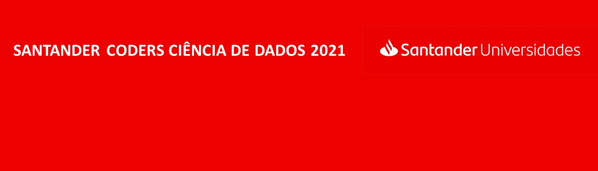

# Curso Python Basics
Este curso foi oferecido pela Let's Code como uma das fases do processo seletivo para obtenção de bolsa do **Santanders Coders Ciência de Dados**.

O curso foi dividido em três partes, são elas:

- ## [Basics](./Basics)
Foi apresentado as estruturas básicas da programação em Python, tais como: variáveis, estruturas condicionais, estruturas de repetição etc.

- ## [Estruturas avançadas](./Estruturas_avançadas)
Foi discutido sobre listas, strings, dicionários, tuplas e funções.

- ## [Aplicações](./Aplicações)
Foi discutido sobre manipulação de arquivos, APIs e feito um projeto final.